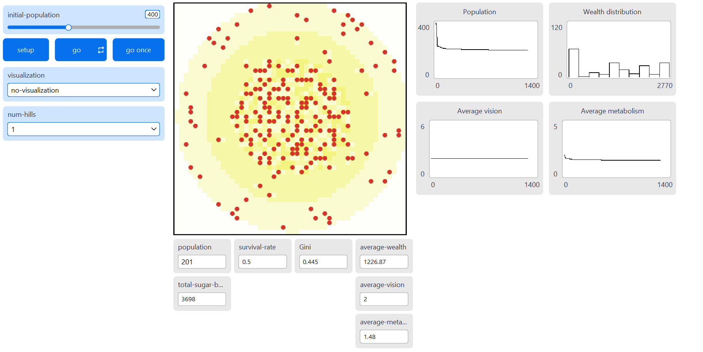

## Declaration of Authorship {.unnumbered .unlisted}

Date: 05 March 2026 (Thurs)

Student Number: 25049107

I, Tee Chin Min Benjamin, pledge my honour that the work presented in this assessment is my own. Where information has been derived from other sources, I confirm that this has been indicated in the work. AI (claude.ai) has been used to develop possible ideas for expanding the SugarScape model and for refining Netlogo code for analysis.

Source code and data can be found at the [attached]{.underline} (<https://github.com/benjamintee/CASA_ABM_Assessment>)

HTML version can be found at the [attached]{.underline} (<https://benjamintee.github.io/CASA_ABM_Assessment/Assignment_1.html>)



## Systematic Experimentation – SugarScape

### 1. Aim

This study investigates how spatial resource distribution and intergenerational wealth transfers shape inequality. Two NetLogo SugarScape models were adapted to examine these mechanisms separately. **SugarScape 2 evaluates how resource concentration (1 peak versus 4 peaks) affects survivability and inequality within a single generation. SugarScape 3 introduces wealth and location inheritance to understand how intergenerational transfers interact with geography to amplify or dampen inequality over time**. Inequality is measured in both using the Gini coefficient[^1].

[^1]: The Gini coefficient measures the inequality of a frequency distribution such as income or wealth levels [@hasell_2023]. A Gini coefficient of 0 reflects perfect equality, where all income or wealth values are the same. In contrast, a Gini coefficient of 1 (or 100%) reflects maximal inequality among values, where a single individual has all the income or wealth while all others have none.

### 2. Background

Economic inequality remains a persistent structural challenge. @piketty_2014 document rising wealth inequality across advanced economies, driven by returns to capital exceeding economic growth. Geography plays a foundational role in shaping these dynamics. @krugman_1991 shows how spatial clustering of economic activity creates self-reinforcing regional inequality while @chetty_2014 demonstrate that a child's place of birth remains one of the strongest predictors of economic mobility in the United States. These findings suggest that spatial resource distribution can imposes structural constraints that individual ability alone cannot overcome. Understanding why inequality emerges and what sustains it is relevant for policymakers designing redistributive interventions.

Intergenerational transfers compound these effects. @nekoei_how_2023 find that inheritances may initially reduce inequality but reverse over time as wealthier heirs accumulate more while poorer heirs deplete transfers.

Because such dynamics are difficult to isolate using traditional econometric methods, agent-based models provide a useful alternative for examining path dependence and emergent inequality [@farmer_2009]. SugarScape [@epstein_1996] offers a useful framework for investigating how geography and inheritance jointly influence wealth stratification.

### 3. Methods

#### 3.1 Model Modifications

SugarScape 2 (Constant Growback) and 3 (Wealth Distribution) from the NetLogo Models Library [@Wilensky_Sugarscape2; @Wilensky_Sugarscape3] were modified to share a common 50×50 landscape and agent trait ranges.

Resource maps were generated programmatically with 1–4 symmetric *hills*, using concentric sugar rings (1-4) scaled to maintain approximately constant total sugar (\~3,700). Agents were assigned random *vision* (1-3), *metabolism* (1–3) and *initial endowment* (10–25).

SugarScape 3 further introduces:

1.  **Wealth Inheritance:** An *inheritance-rate* (0–1) transfers a fraction of a dying agent’s sugar to offspring. Only agents above median wealth pass on sugar, simulating capital preservation opportunities available only to wealthier populations.

2.  **Location Inheritance:** An *inherit-location?* toggle allows offspring to spawn near the parent (within 3 patches) rather than at a random location.

Additional reporters were added to track *inequality (Gini), wealth, survival,* and *mortality*. Full code is in the Appendix.

#### 3.2 Key Assumptions

SugarScape 2 models within-generation competition without replacement. Agents compete for resources and die permanently when sugar reaches zero. With no replacement, the population declines.

SugarScape 3 introduces finite lifespans with *max-age* (60-80) and one-to-one replacement, maintaining a constant population. With *inheritance-rate* set to zero, each generation begins without accumulated advantage. Increasing *inheritance-rate* introduces compounding effects.

All experiments used 400 initial agents and 10 repetitions per parameter combination and 1,000 ticks. Both models assumed constant growback (1 sugar per tick up to patch maximum), without trade, and movement toward the highest-sugar visible patch.

#### 3.3 Experimental Design

[*Experiment 1 (S2)*]{.underline}*:* *num-hills* was varied from 1 to 4 ([Figure 1]{.underline}) to examine spatial concentration effects.


[*Experiment 2 (S3)*]{.underline}*:* *inheritance-rate* was varied at intervals of 0.25 between 0.00 and 1.00, with *inherit-location?* toggled on and off, holding geography constant with *num-hills = 2*.

### 4. Results

#### 4.1 Experiment 1: Resource Concentration and Inequality (S2)

[Figure 2]{.underline} shows how the Gini coefficient changes over time for each hill configuration. All configurations begin with Gini at approximately **0.122** and rise sharply in the first 100 ticks as agents compete for resources and weaker agents die off. The trajectories then plateau. The 1-hill configuration reaches the highest final Gini **(0.448)**, while the 4-hill configuration reaches the lowest **(0.354)**, with 2-hill and 3-hill configurations falling in between.

```{python}
#| label: Load common libraries and packages
#| echo: false
#| warning: false
#| output: false
import pandas as pd
import matplotlib.pyplot as plt
import numpy as np
from great_tables import GT, style, loc, md
```

```{python}
#| label: Parse df_S2 data from behavior space 
#| echo: false
#| warning: false
#| output: false
# Read CSV for S2 output 
df_S2 = pd.read_csv(r"C:\Users\benja\Documents\CASA\CASA\Agent-Based Models and Spatial Systems\CASA_ABM_Assessment\data\Sugarscape 2 S2_baseline-spreadsheet.csv", skiprows=15)
df_S2 = df_S2.iloc[:, 1:]

# The columns should be:
# [all run data], [step], num-hills, gini, population, mean-wealth, mean-vision, mean-metabolism, survival-rate
base_cols = ["step", "num_hills", "gini", "population", 
              "mean_wealth", "mean_vision", "mean_metabolism", "survival_rate"]

new_columns = []
for i in range(40):
    for col in base_cols:
        new_columns.append(f"{col}_{i}")

# Assign these new names to the dataframe
df_S2.columns = new_columns

# 4. Add a unique ID for each of the 1000 rows
df_S2['row_id'] = range(len(df_S2))

# 5. Now wide_to_long will work perfectly
df_S2_long = pd.wide_to_long(
    df_S2, 
    stubnames=base_cols, 
    i='row_id', 
    j='repetition', 
    sep='_', 
    suffix='\\d+'
)

# 6. Final Clean up
df_S2_long = df_S2_long.reset_index()
```

```{python}
#| label: Generate Summary for S2 
#| echo: false
#| warning: false
#| output: false
summary_S2 = (
    df_S2_long[df_S2_long['step'] == 1000]
    .groupby('num_hills')[['gini', 'survival_rate', 'mean_metabolism', 'mean_vision', 'mean_wealth']]
    .agg(['mean', 'std'])
    .round(3)
)
```

```{python}
#| label: chart2
#| echo: false
#| warning: false
fig, ax = plt.subplots(figsize=(8, 5)) 
colors_hills = {1: '#d62728', 2: '#ff7f0e', 3: '#2ca02c', 4: '#1f77b4'}

avg_s2 = df_S2_long.groupby(['num_hills', 'step']).agg(
    mean_gini=('gini', 'mean'),
    std_gini=('gini', 'std')
).reset_index()

for hills in [1, 2, 3, 4]:
    sub = avg_s2[avg_s2['num_hills'] == hills]
    
    # Plotting the lines
    line = ax.plot(sub['step'], sub['mean_gini'], label=f'{hills} hill(s)', 
                   color=colors_hills[hills], linewidth=2)
    
    # Standard deviation shading
    ax.fill_between(sub['step'], 
                    sub['mean_gini'] - sub['std_gini'],
                    sub['mean_gini'] + sub['std_gini'],
                    alpha=0.12, color=colors_hills[hills])
    
    # --- Add labels at the extreme right ---
    final_step = sub['step'].iloc[-1]
    final_val = sub['mean_gini'].iloc[-1]
    
    ax.text(final_step + 15, final_val, f'{final_val:.3f}', 
            color=colors_hills[hills], fontweight='bold',
            va='center', ha='left', fontsize=10)

# 1. Remove Top and Right Spines (Borders)
ax.spines['top'].set_visible(False)
ax.spines['right'].set_visible(False)

# 2. Adjust Grid (optional: remove the top/rightmost grid lines)
ax.grid(True, alpha=0.3, linestyle='--')

# Labels and titles
ax.set_xlabel('Tick', fontsize=11)
ax.set_ylabel('Gini Coefficient', fontsize=11)
ax.set_title('Figure 2: Gini Coefficient Over Time by Resource Concentration (S2)', fontsize=12,  fontweight='bold')

# Adjust x-limit slightly to make room for labels
ax.set_xlim(right=avg_s2['step'].max() * 1.1)

ax.legend(fontsize=11, loc='lower right')
plt.tight_layout()
plt.show()
```

With total sugar held constant, survival rates were broadly similar across configurations, suggesting that resource geography affects the distribution of wealth rather than overall carrying capacity. Mean wealth increased from **959** in the 1-hill setup to **1,117** in the 4-hill setup.

```{python}
#| label: Table 2 
#| echo: false
#| warning: false
#| output: false
final = df_S2_long[df_S2_long['step'] == df_S2_long['step'].max()]
grouped = final.groupby('num_hills')

table = pd.DataFrame({
    'Gini': grouped['gini'].apply(lambda x: f"{x.mean():.3f} ± {x.std():.3f}"),
    'Survival': grouped['survival_rate'].apply(lambda x: f"{x.mean():.2f} ± {x.std():.2f}"),
    'Mean Wealth': grouped['mean_wealth'].apply(lambda x: f"{x.mean():.0f} ± {x.std():.0f}"),
    'Mean Vision': grouped['mean_vision'].apply(lambda x: f"{x.mean():.1f}"),
    'Mean Metabolism': grouped['mean_metabolism'].apply(lambda x: f"{x.mean():.1f}"),
})

table = table.rename(columns={'num_hills': 'Hills'})
```

```{python}
table_df = table.reset_index()

# 2. Build the GT table
(
    GT(table_df)
    # Rename the 'index' (or 'num_hills') column to 'Hills'
    .cols_label(num_hills="Hills") 
    
    # 3. Center align all body columns
    .cols_align(align="center", columns=True)

    # 4. Header Customization: Bold, same font size (1em), no borders
    .tab_header(title="Table 1: Summary Metrics for Experiment 1 (S2)")
    .tab_style(
        style=style.text(weight="bold", size="1.2em", align="center"),
        locations=loc.title()
    )
    
    # 5. Remove borders and adjust widths
    .tab_options(
        table_width="100%",
        heading_border_bottom_style="none",
        table_border_top_style="none",
        table_border_bottom_style="none",
        column_labels_border_top_style="none",
        column_labels_border_bottom_style="solid", 
        column_labels_border_bottom_width="1px"
    )
)
```

#### 4.2 Experiment 2: Inheritance and Inequality (S3)

The introduction of wealth and location inheritance reveals a complex, non-linear relationship between intergenerational transfers and wealth stratification.

#### 4.2.1 Wealth Inheritance only

[Figure 3]{.underline} plots Gini trajectories under varying *inheritance-rate* (0.00-1.00) without location inheritance. At moderate *inheritance-rate* (0.25-0.50), the Gini is lower than the no-inheritance baseline, falling from **0.458** to **0.43**1 at *inheritance-rate = 0.50*. However, at higher *inheritance-rate* (0.75-1.00), the Gini rises sharply above the baseline reaching up to **0.551** at full *inheritance-rate* (1.00).

```{python}
#| label: Parse df_S3a data from behavior space 
#| echo: false
#| warning: false
#| output: false
# Read the CSV from df_S3a without location inheritance
df_S3a = pd.read_csv(r"C:\Users\benja\Documents\CASA\CASA\Agent-Based Models and Spatial Systems\CASA_ABM_Assessment\data\Sugarscape 3 Wealth Distribution_updatedfinal S3_baseline_a-spreadsheet.csv", skiprows=15)

df_S3a = df_S3a.iloc[:, 1:]

base_cols = ["step", "inheritance-rate", "num_hills", "gini", "mean_wealth", 
             "mean_vision", "mean_metabolism", "mean-age", 
             "avg-inheritance", "death-rate", "age-deaths", "starve-deaths"]

new_columns = []
for i in range(50):
    for col in base_cols:
        new_columns.append(f"{col}_{i}")

# Assign these new names to the dataframe
df_S3a.columns = new_columns

# 4. Add a unique ID for each of the 1000 rows
df_S3a['row_id'] = range(len(df_S3a))

# 5. Now wide_to_long will work perfectly
df_S3a_long = pd.wide_to_long(
    df_S3a, 
    stubnames=base_cols, 
    i='row_id', 
    j='repetition', 
    sep='_', 
    suffix='\\d+'
)

# 6. Final Clean up
df_S3a_long = df_S3a_long.reset_index()
```

```{python}
#| label: Summarise df_S3a
#| echo: false
#| warning: false
#| output: false
# 1. Filter for the final step to see the outcome of the simulation
df_S3a_final = df_S3a_long[df_S3a_long['step'] == 999]

# 2. Define the columns you want to summarize
stats_cols = ["gini", "mean_wealth", "mean-age", "mean_vision", "mean_metabolism", "death-rate", "age-deaths", "starve-deaths"]

# 3. Group by inheritance rate and calculate Mean and Std Dev
summary_S3a = df_S3a_final.groupby('inheritance-rate')[stats_cols].agg(['mean', 'std'])

# Flatten the multi-index columns for easier reading
summary_S3a.columns = [f"{col}_{stat}" for col, stat in summary_S3a.columns]
summary_S3a = summary_S3a.reset_index()
```

```{python}
#| label: chart3
#| echo: false
#| warning: false
# Chart Plot: Figure 3 Gini over Time by Inheritance Rate (S3, location off)
fig, ax = plt.subplots(figsize=(8, 5))
colors_inh = {0.00: '#1f77b4', 0.25: '#2ca02c', 0.50: '#ff7f0e', 0.75: '#9467bd', 1.00: '#d62728'}

avg_S3a = df_S3a_long.groupby(['inheritance-rate', 'step']).agg(
    mean_gini=('gini', 'mean'),
    std_gini=('gini', 'std')
).reset_index()

max_step = avg_S3a['step'].max()

# Plot lines and shading
for rate in [0.00, 0.25, 0.50, 0.75, 1.00]:
    sub = avg_S3a[avg_S3a['inheritance-rate'] == rate]
    ax.plot(sub['step'], sub['mean_gini'], label=f'Inheritance = {rate}',
            color=colors_inh[rate], linewidth=2)
    ax.fill_between(sub['step'],
                    sub['mean_gini'] - sub['std_gini'],
                    sub['mean_gini'] + sub['std_gini'],
                    alpha=0.12, color=colors_inh[rate])

# Collect final values for labels
label_data = []
for rate in [0.00, 0.25, 0.50, 0.75, 1.00]:
    sub = avg_S3a[avg_S3a['inheritance-rate'] == rate]
    final_val = sub['mean_gini'].iloc[-1]
    label_data.append({'rate': rate, 'val': final_val, 'display': final_val})

# Sort by value and space out overlapping labels
label_data.sort(key=lambda x: x['val'])
min_distance = 0.012
for i in range(1, len(label_data)):
    if label_data[i]['display'] - label_data[i-1]['display'] < min_distance:
        label_data[i]['display'] = label_data[i-1]['display'] + min_distance

# Place labels
for item in label_data:
    ax.text(max_step + 10, item['display'], f"{item['val']:.3f}",
            color=colors_inh[item['rate']], fontweight='bold',
            va='center', ha='left', fontsize=10)

# Aesthetics
ax.spines['top'].set_visible(False)
ax.spines['right'].set_visible(False)
ax.grid(True, alpha=0.3, linestyle='--')
ax.set_xlabel('Tick', fontsize=11)
ax.set_ylabel('Gini Coefficient', fontsize=11)
ax.set_title('Figure 3: Gini Over Time by Inheritance Rate (S3a, Without Location Inheritance )', fontsize=12, fontweight='bold')
ax.set_xlim(right=max_step * 1.1)
ax.legend(fontsize=10, loc='lower right', frameon=False)
plt.tight_layout()
plt.show()
```

This U-shaped pattern reflects two competing dynamics. Moderate inheritance acts as insurance where offspring of above-median agents receive a buffer that reduces the impact of unfavourable random traits, compressing the wealth distribution. At higher *inheritance-rate* the larger transfers create persistent wealth differences where wealth compounds across generations faster than it dissipates. *Mean wealth* rises significantly from **35** at baseline to **183** at full *inheritance-rate* ([Table 2]{.underline}). *Death rate* decreases monotonically from **9.6** to **7.5**, with fewer starvation deaths as *inheritance-rate* increases, corroborating the insurance effect.

```{python}
#| label: Summarise table 2 for dfS3a 
#| echo: false
#| warning: false
#| output: false
# Filter for the final step of the simulation
final_S3a = df_S3a_long[df_S3a_long['step'] == df_S3a_long['step'].max()]

# Group by inheritance-rate
grouped_S3a = final_S3a.groupby('inheritance-rate')

# Generate the summary table
table_S3a = pd.DataFrame({
    'Gini': grouped_S3a['gini'].apply(lambda x: f"{x.mean():.3f} ± {x.std():.3f}"),
    'Mean Wealth': grouped_S3a['mean_wealth'].apply(lambda x: f"{x.mean():.0f} ± {x.std():.0f}"),
    'Mean Vision': grouped_S3a['mean_vision'].apply(lambda x: f"{x.mean():.1f}"),
    'Mean Metabolism': grouped_S3a['mean_metabolism'].apply(lambda x: f"{x.mean():.1f}"),
    'Death Rate': grouped_S3a['death-rate'].apply(lambda x: f"{x.mean():.1f} ± {x.std():.1f}"),
    'Age Deaths': grouped_S3a['age-deaths'].apply(lambda x: f"{x.mean():.0f}"),
    'Starvation Deaths': grouped_S3a['starve-deaths'].apply(lambda x: f"{x.mean():.0f}"),
})

```

```{python}
table_S3a_df = table_S3a.reset_index()
(
    GT(table_S3a_df)
   
    # 3. Center align all body columns
    .cols_label(**{
        "inheritance-rate": md("Inherit.<br>Rate"),
        "Mean Wealth": md("Mean<br>Wealth"),
        "Mean Vision": md("Mean<br>Vision"),
        "Mean Metabolism": md("Mean<br>Metabolism"),
        "Death Rate": md("Death<br>Rate"),
        "Age Deaths": md("Age<br>Deaths"),
        "Starvation Deaths": md("Starve. <br>Deaths"),
    })
    .cols_align(align="center", columns=True)

    # .cols_width(
    #     cases={
    #         "inheritance-rate": "90px",
    #         "Gini": "120px",
    #         "Mean Wealth": "110px",
    #         "Mean Vision": "110px",
    #         "Mean Metabolism": "110px",
    #         "Death Rate": "80px",
    #         "Age Deaths": "80px",
    #         "Starvation Deaths": "80px",
    #     }
    # )
    # 4. Header Customization: Bold, same font size (1em), no borders
    .tab_header(title="Table 2: Summary Metrics for Experiment 2 (S3a - Without location inheritance)")
    .tab_style(
        style=style.text(weight="bold", size="1.2em", align="center"),
        locations=loc.title()
    )
    
    # 5. Remove borders and adjust widths
    .tab_options(
        table_width="100%",
        table_font_size="small",
        row_striping_include_table_body=True,
        heading_border_bottom_style="none",
        table_border_top_style="none",
        table_border_bottom_style="none",
        column_labels_border_top_style="none",
        column_labels_border_bottom_style="solid", 
        column_labels_border_bottom_width="1px"
    )
)
```

#### 4.2.2 Wealth and Location Inheritance

Enabling location inheritance generally reduces inequality compared to wealth inheritance alone ([Figure 4 and 5]{.underline}). At the wealth inheritance baseline, simply allowing offspring to start near their parent's location reduces the Gini from **0.458** to **0.396**. This occurs because offspring of successful agents are born near productive resource hills, reducing "search cost" and starvation risk, uplifting the broader base of agents.

[Figure 5]{.underline} illustrates how location inheritance significantly accelerates wealth accumulation. At full *inheritance-rate* (1.0), *mean wealth* nearly doubles from **183** (without location inheritance) to **342** (with location inheritance). This accumulation is driven by improvements in mortality where *starvation deaths* drop from **5,265** to **4,028** when location inheritance is added, allowing more agents to survive until they die of old age.

```{python}
#| label: Parse df_S3b data from behavior space 
#| echo: false
#| warning: false
#| output: false
df_S3b = pd.read_csv(r"C:\Users\benja\Documents\CASA\CASA\Agent-Based Models and Spatial Systems\CASA_ABM_Assessment\data\Sugarscape 3 Wealth Distribution_updatedfinal S3_baseline_b-spreadsheet.csv", skiprows=15)

df_S3b = df_S3b.iloc[:, 1:]

base_cols = ["step", "inheritance-rate", "num_hills", "gini", "mean_wealth", 
             "mean_vision", "mean_metabolism", "mean-age", 
             "avg-inheritance", "death-rate", "age-deaths", "starve-deaths"]

new_columns = []
for i in range(50):
    for col in base_cols:
        new_columns.append(f"{col}_{i}")

# Assign these new names to the dataframe
df_S3b.columns = new_columns

# 4. Add a unique ID for each of the 1000 rows
df_S3b['row_id'] = range(len(df_S3b))

# 5. Now wide_to_long will work perfectly
df_S3b_long = pd.wide_to_long(
    df_S3b, 
    stubnames=base_cols, 
    i='row_id', 
    j='repetition', 
    sep='_', 
    suffix='\\d+'
)

# 6. Final Clean up
df_S3b_long = df_S3b_long.reset_index()
```

```{python}
#| label: Summarise table 3 for dfS3b
#| echo: false
#| warning: false
#| output: false
# Filter for the final step of the simulation
final_S3b = df_S3b_long[df_S3b_long['step'] == df_S3b_long['step'].max()]

# Group by inheritance-rate
grouped_S3b = final_S3b.groupby('inheritance-rate')

# Generate the summary table
table_S3b = pd.DataFrame({
    'Gini': grouped_S3b['gini'].apply(lambda x: f"{x.mean():.3f} ± {x.std():.3f}"),
    'Mean Wealth': grouped_S3b['mean_wealth'].apply(lambda x: f"{x.mean():.0f} ± {x.std():.0f}"),
    'Mean Vision': grouped_S3b['mean_vision'].apply(lambda x: f"{x.mean():.1f}"),
    'Mean Metabolism': grouped_S3b['mean_metabolism'].apply(lambda x: f"{x.mean():.1f}"),
    'Death Rate': grouped_S3b['death-rate'].apply(lambda x: f"{x.mean():.1f} ± {x.std():.1f}"),
    'Age Deaths': grouped_S3b['age-deaths'].apply(lambda x: f"{x.mean():.0f}"),
    'Starvation Deaths': grouped_S3b['starve-deaths'].apply(lambda x: f"{x.mean():.0f}"),
})
```

```{python}
#| label: chart4
#| echo: false
#| warning: false
# Chart Plot: Figure 4 Gini over Time by Inheritance Rate (S3, location inheritance on)
fig, ax = plt.subplots(figsize=(8, 5))
colors_inh = {0.00: '#1f77b4', 0.25: '#2ca02c', 0.50: '#ff7f0e', 0.75: '#9467bd', 1.00: '#d62728'}

avg_S3b = df_S3b_long.groupby(['inheritance-rate', 'step']).agg(
    mean_gini=('gini', 'mean'),
    std_gini=('gini', 'std')
).reset_index()

max_step = avg_S3b['step'].max()

# Plot lines and shading
for rate in [0.00, 0.25, 0.50, 0.75, 1.00]:
    sub = avg_S3b[avg_S3b['inheritance-rate'] == rate]
    ax.plot(sub['step'], sub['mean_gini'], label=f'Inheritance = {rate}',
            color=colors_inh[rate], linewidth=2)
    ax.fill_between(sub['step'],
                    sub['mean_gini'] - sub['std_gini'],
                    sub['mean_gini'] + sub['std_gini'],
                    alpha=0.12, color=colors_inh[rate])

# Collect final values for labels
label_data = []
for rate in [0.00, 0.25, 0.50, 0.75, 1.00]:
    sub = avg_S3b[avg_S3b['inheritance-rate'] == rate]
    final_val = sub['mean_gini'].iloc[-1]
    label_data.append({'rate': rate, 'val': final_val, 'display': final_val})

# Sort by value and space out overlapping labels
label_data.sort(key=lambda x: x['val'])
min_distance = 0.012
for i in range(1, len(label_data)):
    if label_data[i]['display'] - label_data[i-1]['display'] < min_distance:
        label_data[i]['display'] = label_data[i-1]['display'] + min_distance

# Place labels
for item in label_data:
    ax.text(max_step + 10, item['display'], f"{item['val']:.3f}",
            color=colors_inh[item['rate']], fontweight='bold',
            va='center', ha='left', fontsize=10)

# Aesthetics
ax.spines['top'].set_visible(False)
ax.spines['right'].set_visible(False)
ax.grid(True, alpha=0.3, linestyle='--')
ax.set_xlabel('Tick', fontsize=11)
ax.set_ylabel('Gini Coefficient', fontsize=11)
ax.set_title('Figure 4: Gini Over Time by Inheritance Rate (S3b, With Location Inheritance)', fontsize=12,  fontweight='bold')
ax.set_xlim(right=max_step * 1.1)
ax.legend(fontsize=10, loc='lower right', frameon=False)
plt.tight_layout()
plt.show()
```

```{python}
# Convert to GT object for rendering
table_S3b_df = table_S3b.reset_index()

(
    GT(table_S3b_df)
   
    # 3. Center align all body columns
    .cols_label(**{
        "inheritance-rate": md("Inherit.<br>Rate"),
        "Mean Wealth": md("Mean<br>Wealth"),
        "Mean Vision": md("Mean<br>Vision"),
        "Mean Metabolism": md("Mean<br>Metabolism"),
        "Death Rate": md("Death<br>Rate"),
        "Age Deaths": md("Age<br>Deaths"),
        "Starvation Deaths": md("Starve. <br>Deaths"),
    })
    .cols_align(align="center", columns=True)

    # .cols_width(
    #     cases={
    #         "inheritance-rate": "90px",
    #         "Gini": "120px",
    #         "Mean Wealth": "110px",
    #         "Mean Vision": "110px",
    #         "Mean Metabolism": "110px",
    #         "Death Rate": "80px",
    #         "Age Deaths": "80px",
    #         "Starvation Deaths": "80px",
    #     }
    # )

    # 4. Header Customization: Bold, same font size (1em), no borders
    .tab_header(title="Table 3: Summary Metrics for Experiment 2 (S3b - With location inheritance)")
    .tab_style(
        style=style.text(weight="bold", size="1.1em", align="center"),
        locations=loc.title())
    .tab_style(
      style=style.css("white-space: nowrap;"),
      locations=loc.body(columns="Gini")
    )
    
    # 5. Remove borders and adjust widths
    .tab_options(
            table_width="100%",
            row_striping_include_table_body=True,
            heading_border_bottom_style="none",
            table_border_top_style="none",
            table_border_bottom_style="none",
            column_labels_border_top_style="none",
            column_labels_border_bottom_style="solid", 
            column_labels_border_bottom_width="1px"
        )
)
```

```{python}
#| label: chart5-comparison-outcomes
#| echo: false
#| warning: false
fig, axes = plt.subplots(3, 2, figsize=(8, 8))
axes = axes.flatten()

# Prepare final tick data
final_a = df_S3a_long[df_S3a_long['step'] == df_S3a_long['step'].max()].copy()
final_a['location'] = 'Off'
final_b = df_S3b_long[df_S3b_long['step'] == df_S3b_long['step'].max()].copy()
final_b['location'] = 'On'
final = pd.concat([final_a, final_b], ignore_index=True)

rates = [0.00, 0.25, 0.50, 0.75, 1.00]
x = np.arange(len(rates))
width = 0.42

metrics = [
    ('gini', 'Gini Coefficient', '.3f'),
    ('mean_wealth', 'Mean Wealth', '.0f'),
    ('mean_metabolism', 'Mean Metabolism', '.1f'),
    ('death-rate', 'Death Rate', '.1f'),
    ('starve-deaths', 'Starvation Deaths (cumulative)', '.0f'),
    ('age-deaths', 'Old Age Deaths (cumulative)', '.0f'),
]

for i, (col, title, fmt) in enumerate(metrics):
    ax = axes[i]
    
    off_mean = [final[(final['inheritance-rate'] == r) & (final['location'] == 'Off')][col].mean() for r in rates]
    on_mean = [final[(final['inheritance-rate'] == r) & (final['location'] == 'On')][col].mean() for r in rates]
    
    bars_off = ax.bar(x - width/2, off_mean, width,
                      label='Without location-inheritance', color='#1f77b4', alpha=0.85)
    bars_on = ax.bar(x + width/2, on_mean, width,
                     label='With location-inheritance', color='#ff7f0e', alpha=0.85)
    
    # Value labels on top of bars
    for j, (off_v, on_v) in enumerate(zip(off_mean, on_mean)):
        ax.text(j - width/2, off_v, f'{off_v:{fmt}}',
                ha='center', va='bottom', fontsize=7.5, color='#1f77b4', fontweight='bold')
        ax.text(j + width/2, on_v, f'{on_v:{fmt}}',
                ha='center', va='bottom', fontsize=7.5, color='#ff7f0e', fontweight='bold')
    
    y_max = max(max(off_mean), max(on_mean))
    ax.set_ylim(top=y_max * 1.12)
    
    ax.set_xticks(x)
    ax.set_xticklabels(rates)
    ax.set_xlabel('Wealth Inheritance Rate', fontsize=10)
    ax.set_title(title, fontsize=11, fontweight='bold')
    ax.spines['top'].set_visible(False)
    ax.spines['right'].set_visible(False)
    ax.grid(True, alpha=0.3, linestyle='--', axis='y')


fig.suptitle('Figure 5: Effect of Location Inheritance Across Metrics (S3)', fontsize=13, fontweight='bold', y = 1.01)

# Single shared legend at the top
handles, labels = axes[0].get_legend_handles_labels()
fig.legend(handles, labels, loc='upper center', ncol=2, fontsize=10, 
           frameon=False, bbox_to_anchor=(0.5, 0.98))

# Footnote
fig.text(0.5, -0.01, 'Note: Values represent the mean outcome at t=1000 across 10 repetitions per parameter combination.',
         ha='center', fontsize=9, fontstyle='italic', color='grey')

plt.subplots_adjust(hspace=0.35, wspace=0.0)
plt.tight_layout(rect=[0, 0, 1, 0.99])
plt.show()
```

#### 4.2.2 Comparison between experiments

The experiments reveal that geography establishes a structural baseline range of inequality generated through spatial competition, within which intergenerational mechanisms operate.

At low to moderate inheritance rates (0.25–0.50), inequality falls below the spatial-only baseline as modest transfers buffer stochastic disadvantage and compress dispersion, even while mean wealth rises. Once inheritance exceeds a threshold (≥ 0.75), accumulation dominates: wealth persists and compounds across generations faster than it dissipates. Inequality then surpasses the spatial baseline, reaching 0.551 at full inheritance without location persistence and 0.541 with it. Intergenerational transmission therefore operates as a regime-switching mechanism, dampening geography-driven inequality at moderate levels but transforming it into durable stratification at high levels.

While the Gini coefficient provides a consistent basis for comparison across models, it captures different structural forms of inequality. In SugarScape 2, inequality reflects competitive selection within a single generation, driven by spatial concentration and trait variation. In SugarScape 3a, the Gini captures capital persistence, where wealth differences compound across generations. In SugarScape 3b, inequality becomes spatially embedded, reflecting the intergenerational transmission of both capital and locational advantage. Thus, similar Gini values across experiments may reflect fundamentally different generative mechanisms.

### 5. Discussion

#### 5.1 Wealth inheritance dynamics (Insurance vs Accumulation)

The results highlight an interesting dual-nature of wealth inheritance. At low levels, it functions as a social safety net, reducing the number of "stochastic deaths" caused by poor trait draws (e.g., high metabolism or poor location endowment). However, as *inheritance-rate* approaches 1.0, the system transitions into a dynastic regime. Wealth becomes less a signal of agent fitness (vision or metabolism) but of ancestral luck.

The model also showed that location inheritance can function as a powerful wealth multiplier. When agents inherit both sugar and proximity to resource hills, mean wealth at full inheritance nearly doubled. This mirrors structural advantages in real-world systems that allow the wealthy to compound gains through passive proximity to opportunities, while the poor are forced to perform with near-flawless efficiency to achieve similar outcomes.

#### 5.2 Limitations and Sensitivities

While the model provides insights into the mechanics of wealth stratification, several limitations must be noted.

-   **Constant Population:** The model utilizes a one-to-one replacement system upon agent death (*hatch 1*). In real-world systems, birth rates often correlate inversely with wealth, which could create steeper inequality trajectories.

-   **Static Resource Hills:** In a more dynamic environment, resource depletion or shifting climates could force migration, potentially disrupting the "location inheritance" advantage.

-   **Trait Sensitivity:** The Gini trajectories are highly sensitive to the metabolism and vision ratio. If metabolism were increased relative to sugar grow-back rates, the "insurance effect" of moderate inheritance might disappear, as even a small inheritance would be insufficient to prevent risk of starvation.

-   **Limitations of the Gini coefficient:** While the Gini coefficient provides a consistent basis for comparing inequality across spatial and inheritance regimes, it captures only the dispersion of wealth at a given moment, and does not distinguish between inequality arising from competitive selection and that arising from dynastic persistence. In high-inheritance scenarios, measured inequality may resemble or even fall below spatial-only baselines, yet wealth becomes increasingly decoupled from agent traits and more dependent on inherited position. The Gini therefore detects distributional change but not the underlying mechanism generating it. Future extensions could incorporate mobility (e.g. Rank-Rank slope [@van_der_erve_2024; @Joanna_Venator_2015]) or lineage-based measures to better capture structural persistence.

### 6. Conclusion

This study shows that spatial resource distribution establishes a structural baseline for inequality, but intergenerational transmission shapes how that inequality evolves. In the absence of inheritance, inequality reflects spatial competition and trait-based selection. Introducing wealth transfers produces a non-linear effect where moderate inheritance reduces inequality by buffering agents against stochastic disadvantage, while high inheritance generates compounding effects that exceeds the inequality produced by geography alone.

Location inheritance reinforces these dynamics by lowering survival risk near productive resource clusters and accelerating wealth accumulation. As inheritance rate increases, wealth becomes progressively detached from individual traits and more dependent on inherited position within the spatial landscape.

These findings suggest that inequality is shaped not only by unequal access to space, but by the mechanisms that allow advantage to persist and accumulate across generations. Policies aimed at reducing inequality must therefore address both spatial disparities in opportunity and the channels through which unfair wealth and locational advantages are transmitted.



### Additional Diagrams  

Screenshot of Netlogo Interface under Experiment 1 (S2)



Screenshot of Netlogo Interface under Experiment 2 (S3)


Full code can be found at the [attached]{.underline} (<https://github.com/benjamintee/CASA_ABM_Assessment>)

### References